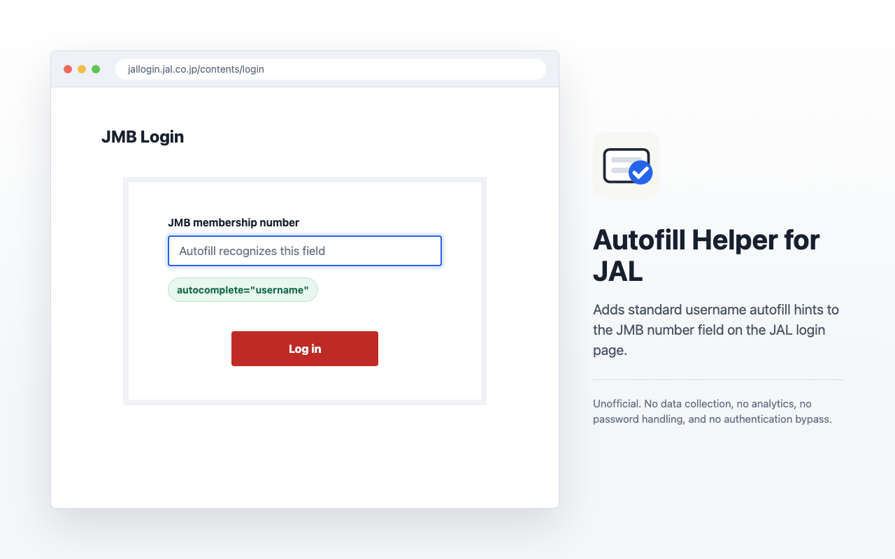

# Autofill Helper for JAL (Unofficial)

Tiny unpacked Chrome extension for `https://jallogin.jal.co.jp/contents/login*`.

It adds autofill hints to JAL's JMB number input:

- `autocomplete="username"`
- `inputmode="numeric"`
- `aria-label="JMB membership number username"`

It intentionally does not rename the original `name="id"` field, because JAL's React login handler appears to depend on that name.

This extension is not affiliated with, endorsed by, or sponsored by Japan Airlines or the JAL Group.

## What It Does

JAL's passkey login page contains a JMB membership number field, but does not expose the usual browser autofill hints that password managers often use to identify username fields. This extension adds those hints locally in your browser.

It does not:

- read, store, or transmit your JMB number
- read, store, or transmit passwords
- access cookies or sessions
- click login buttons
- bypass passkeys, MFA, fraud checks, or other security controls
- run on websites other than `jallogin.jal.co.jp/contents/login`

## Install

1. Open `chrome://extensions`.
2. Enable Developer mode.
3. Click "Load unpacked".
4. Select this repository folder.

5. Reload the JAL login page.
6. Open the password login form, then use Bitwarden autofill manually if needed.

Recommended Bitwarden URI:

`https://jallogin.jal.co.jp`

If Bitwarden still misses the JMB field, add linked custom fields in the Bitwarden item:

- `id` -> Username
- `LA_input-number-01` -> Username

## Privacy

See [PRIVACY.md](./PRIVACY.md).

## License

MIT. See [LICENSE](./LICENSE).
